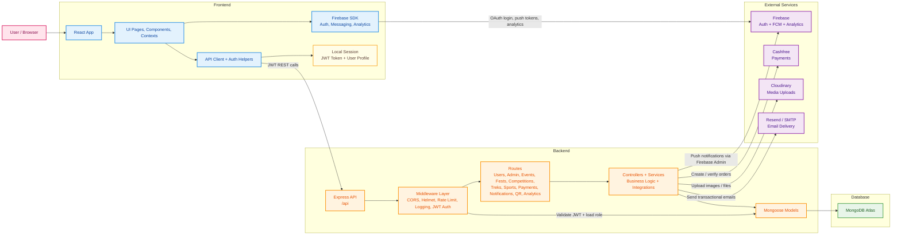

# CrwdCtrl Architecture

```mermaid
flowchart LR
  classDef user fill:#FFE4EC,stroke:#D81B60,stroke-width:2px,color:#880E4F;
  classDef frontend fill:#E3F2FD,stroke:#1E88E5,stroke-width:2px,color:#0D47A1;
  classDef backend fill:#FFF3E0,stroke:#FB8C00,stroke-width:2px,color:#E65100;
  classDef database fill:#E8F5E9,stroke:#43A047,stroke-width:2px,color:#1B5E20;
  classDef external fill:#F3E5F5,stroke:#8E24AA,stroke-width:2px,color:#4A148C;
  classDef session fill:#FFFDE7,stroke:#F9A825,stroke-width:2px,color:#5D4037;

  U["User / Browser"]:::user

  subgraph FE["Frontend"]
    direction TB
    FE1["React App"]:::frontend
    FE2["UI Pages, Components, Contexts"]:::frontend
    FE3["API Client + Auth Helpers"]:::frontend
    FE4["Firebase SDK<br/>Auth, Messaging, Analytics"]:::frontend
    FE5["Local Session<br/>JWT Token + User Profile"]:::session
  end

  subgraph BE["Backend"]
    direction TB
    BE1["Express API<br/>/api"]:::backend
    BE2["Middleware Layer<br/>CORS, Helmet, Rate Limit, Logging, JWT Auth"]:::backend
    BE3["Routes<br/>Users, Admin, Events, Fests, Competitions,<br/>Treks, Sports, Payments, Notifications, QR, Analytics"]:::backend
    BE4["Controllers + Services<br/>Business Logic + Integrations"]:::backend
    BE5["Mongoose Models"]:::backend
  end

  subgraph DB["Database"]
    direction TB
    DB1["MongoDB Atlas"]:::database
  end

  subgraph EXT["External Services"]
    direction TB
    X1["Firebase<br/>Auth + FCM + Analytics"]:::external
    X2["Cashfree<br/>Payments"]:::external
    X3["Cloudinary<br/>Media Uploads"]:::external
    X4["Resend / SMTP<br/>Email Delivery"]:::external
  end

  U --> FE1
  FE1 --> FE2
  FE2 --> FE3
  FE2 --> FE4
  FE3 --> FE5

  FE3 -->|"JWT REST calls"| BE1
  FE4 -->|"OAuth login, push tokens, analytics"| X1

  BE1 --> BE2 --> BE3 --> BE4 --> BE5 --> DB1
  BE2 -->|"Validate JWT + load role"| BE5

  BE4 -->|"Create / verify orders"| X2
  BE4 -->|"Upload images / files"| X3
  BE4 -->|"Send transactional emails"| X4
  BE4 -->|"Push notifications via Firebase Admin"| X1
```

This diagram reflects the current codebase structure in CrwdCtrl and the main runtime data flow between the client, API, database, and external integrations.