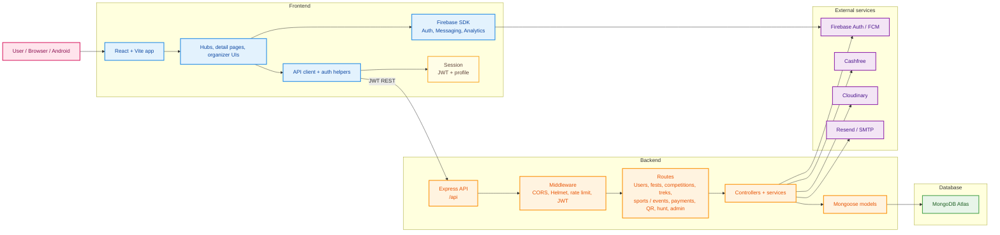

# CrwdCtrl Architecture

High-level view of how the web client, API, database, and external services fit together.

```mermaid
flowchart LR
  classDef user fill:#FFE4EC,stroke:#D81B60,stroke-width:2px,color:#880E4F;
  classDef frontend fill:#E3F2FD,stroke:#1E88E5,stroke-width:2px,color:#0D47A1;
  classDef backend fill:#FFF3E0,stroke:#FB8C00,stroke-width:2px,color:#E65100;
  classDef database fill:#E8F5E9,stroke:#43A047,stroke-width:2px,color:#1B5E20;
  classDef external fill:#F3E5F5,stroke:#8E24AA,stroke-width:2px,color:#4A148C;
  classDef session fill:#FFFDE7,stroke:#F9A825,stroke-width:2px,color:#5D4037;

  U["User / Browser / Android"]:::user

  subgraph FE["Frontend"]
    direction TB
    FE1["React + Vite app"]:::frontend
    FE2["Hubs, detail pages, organizer UIs"]:::frontend
    FE3["API client + auth helpers"]:::frontend
    FE4["Firebase SDK<br/>Auth, Messaging, Analytics"]:::frontend
    FE5["Session<br/>JWT + profile"]:::session
  end

  subgraph BE["Backend"]
    direction TB
    BE1["Express API<br/>/api"]:::backend
    BE2["Middleware<br/>CORS, Helmet, rate limit, JWT"]:::backend
    BE3["Routes<br/>Users, fests, competitions, treks,<br/>sports / events, payments, QR, hunt, admin"]:::backend
    BE4["Controllers + services"]:::backend
    BE5["Mongoose models"]:::backend
  end

  subgraph DB["Database"]
    DB1["MongoDB Atlas"]:::database
  end

  subgraph EXT["External services"]
    X1["Firebase Auth / FCM"]:::external
    X2["Cashfree"]:::external
    X3["Cloudinary"]:::external
    X4["Resend / SMTP"]:::external
  end

  U --> FE1
  FE1 --> FE2 --> FE3
  FE2 --> FE4
  FE3 --> FE5
  FE3 -->|"JWT REST"| BE1
  FE4 --> X1
  BE1 --> BE2 --> BE3 --> BE4 --> BE5 --> DB1
  BE4 --> X2
  BE4 --> X3
  BE4 --> X4
  BE4 --> X1
```

Product overview and local setup: [README.md](./README.md).
