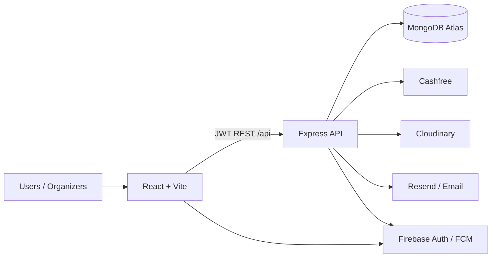

# CrwdCtrl

**Discover college fests, run clubs, treks, and local events — then register, pay, and check in in one place.**

Live product: [www.crwdctrl.in](https://www.crwdctrl.in)

CrwdCtrl is a full-stack community & event platform built for Indian campuses and local organizers. Participants browse and book; organizers run registrations, payments, and QR gate check-in from dedicated portals.

---

## Highlights

- **Multi-category discovery** — college fests & competitions, running clubs, treks, community events, shows
- **Organizer portals** — fest, trek, run-club / event-community, and event-show dashboards
- **Payments** — Cashfree (and related flows) with tickets / QR proof where needed
- **QR check-in** — scanner flows for gates and volunteers
- **Campus Hunt** — scavenger-hunt module for fest activations
- **Auth** — Google / Firebase + JWT sessions
- **Mobile** — responsive PWA + Capacitor Android shell

---

## Screenshots

> Add product shots here when you publish (Home · Fest detail · Booking · Organizer dashboard · Scanner).

| Home | Event detail | Organizer |
|------|--------------|-----------|
| _TODO_ | _TODO_ | _TODO_ |

---

## Stack

| Layer | Tech |
|-------|------|
| **Frontend** | React 19, Vite 7, Tailwind CSS 4, React Router 7, Framer Motion, Firebase, Capacitor 8, Sentry, vite-plugin-pwa |
| **Backend** | Node.js 18+, Express 5, MongoDB / Mongoose 8, JWT, Firebase Admin, Helmet, rate limiting |
| **Integrations** | Cashfree, Cloudinary, Resend / Nodemailer, Sentry, Google APIs |
| **Deploy** | Frontend on Railway (Caddy static + `/api` proxy) · Backend on Railway · MongoDB Atlas |

---

## Monorepo layout

```
CrwdCtrl/
├── frontend/          # React app (Vite) + Capacitor Android
├── backend/           # Express API
├── ARCHITECTURE.md    # System diagram
├── DEPLOYMENT.md      # Deploy notes
├── SECURITY.md        # Vulnerability reporting
└── LICENSE
```

Everything product-critical lives in `frontend/` and `backend/`. Copy env templates from each package’s `.env.example` — never commit real `.env` files.

---

## Architecture



See [ARCHITECTURE.md](./ARCHITECTURE.md) for a fuller diagram.

---

## Features by role

### Participants
Browse hubs (fests, sports, treks, events), open shareable detail pages, register / book, pay, and show QR tickets.

### Organizers
Dedicated logins for fests, treks, run clubs / event communities, and shows — guests, coupons, notifications, scan, settlements.

### Admins
Platform controls for listings, sections, coupons, payments overview, and ops tools.

---

## Run locally

**Requirements:** Node.js 18+, MongoDB (local or Atlas).

### Backend

```bash
cd backend
cp .env.example .env   # fill MongoDB, JWT, Firebase Admin, etc.
npm install
npm run dev            # default http://localhost:8080
```

### Frontend

```bash
cd frontend
cp .env.example .env   # set VITE_API_BASE_URL=http://localhost:8080/api
npm install
npm run dev            # Vite → http://localhost:5173
```

Health check: `GET http://localhost:8080/api/health` (or your configured port).

---

## Environment

| Package | Template |
|---------|----------|
| Backend | [`backend/.env.example`](./backend/.env.example) |
| Frontend | [`frontend/.env.example`](./frontend/.env.example) |

Client `VITE_*` keys (Firebase web config, etc.) are expected in the browser. **Server secrets** (Mongo URI, JWT, Cashfree secrets, Firebase Admin JSON, email keys) stay only in Railway / local `.env`.

---

## Scripts

| Command | Where | What |
|---------|-------|------|
| `npm run dev` | frontend / backend | Local development |
| `npm run build` | frontend | Production Vite build + SEO prerender |
| `npm test` | frontend / backend | Unit / module tests |
| `npm run cap:sync:prod` | frontend | Android Capacitor prod sync |

---

## Security

Please report vulnerabilities privately — see [SECURITY.md](./SECURITY.md).

---

## License

MIT — see [LICENSE](./LICENSE).

Built by [Karan Jadhav](https://github.com/lolbhailol-lol) · Product: [crwdctrl.in](https://www.crwdctrl.in)
