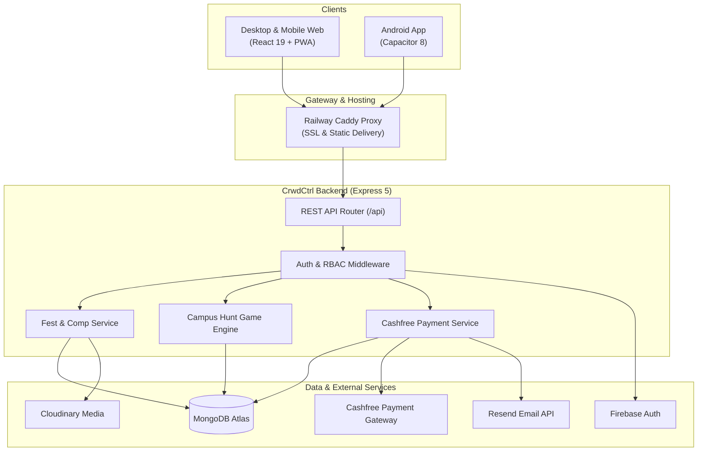

# CrwdCtrl

> **The participation network for college life.**

Live product: [www.crwdctrl.in](https://www.crwdctrl.in)

CrwdCtrl is a dedicated participation and competition platform built specifically for Indian college campuses. It unifies college fests, inter-college competitions, campus activations, and live games under a single verified student identity (**CrwdCtrl ID**), backed by institutional leaderboards and seamless QR gate operations.

---

## 🎯 Product Direction & Positioning

CrwdCtrl is strictly focused on **campus participation**:

- 🎪 **College Fests** — Flagship tech, cultural, and sports festivals (e.g. MindSpark, Aarohan, Kshitij, Techfest).
- 🏆 **College Competitions** — Multi-category events (Coding, Robotics, Debate, Dance, Sports, Esports) with single & team registrations.
- ⚡ **CrwdCtrl Games (Powered by Campus Hunt)** — Real-time interactive campus scavenger hunts, checkpoint races, QR clues, and finale missions.
- 🪪 **CrwdCtrl ID** — One verified student identity across events, preserving verified participation history, certificates, and trophies.
- 📊 **Leaderboards & Championships** — Real-time team, college, and inter-college city standings (towards the Pune Inter-College Championship).

> **What CrwdCtrl is NOT:**
> CrwdCtrl is **not** an Unstop clone, **not** a job/internship portal, **not** a general social network, and **not** a generic consumer ticket marketplace for treks or run clubs.

---

## ✨ Key Features

### 1. Fests & Competitions Engine
- **Multi-Fest Discovery & Microsites**: Dedicated fest landing pages with event schedules, prize pools, rulebooks, and category filtering.
- **Team & Solo Registration**: Dynamic team-size enforcement, captain & member roster management, and automated eligibility checks.
- **Payment & Checkout**: Seamless Cashfree gateway integration with instant settlement, coupon codes, and automated receipt generation.
- **QR Tickets & Gate Operations**: Cryptographically verifiable QR passes with volunteer/organizer scanner web apps for rapid gate entry.

### 2. CrwdCtrl Games & Campus Hunt
- **Staggered-Start Scavenger Hunts**: Automated route balancing to prevent bottlenecking across campus checkpoints.
- **Anti-Cheat & Location Intelligence**: Time-window validation, sequential clue unlocks, and tamper-resistant verifications.
- **Offline-First PWA Play**: Service-worker backed gameplay shell allowing seamless progression during spotty campus Wi-Fi/4G.
- **Live Leaderboard & Finale**: Real-time scoring engine with live scoreboards, penalty tracking, and multi-stage finale unlocks.

### 3. CrwdCtrl ID & Student Profiles
- Universal student credentials linked with college affiliation, academic year, and contact details.
- Centralized participation record for fast registration across participating fests without re-entering roster details.

### 4. Organizer Portals & Control Centers
- Specialized administrative dashboards for fest convenors, competition heads, and event volunteers.
- Real-time attendance counters, check-in desks, exportable participant rosters, and financial reconciliation.

---

## 🛠 Tech Stack

| Layer | Technologies |
|---|---|
| **Frontend** | React 19, Vite 7, React Router 7, Tailwind CSS 4, Framer Motion, Lucide Icons |
| **Mobile & PWA** | Capacitor 8 (Android shell), `vite-plugin-pwa`, Workbox offline caching |
| **Backend API** | Node.js 18+, Express 5, Mongoose 8 / MongoDB Atlas |
| **Auth & Security** | Firebase Auth (Google OAuth) + Custom JWT session tokens, Helmet, Rate-limiting |
| **Integrations** | Cashfree Payments API, Cloudinary (CDN assets), Resend / Nodemailer (Transactional email) |
| **Deployment** | Railway (Frontend Caddy reverse-proxy & Node API service), MongoDB Atlas |

---

## 📂 Repository Structure

```
CrwdCtrl/
├── backend/
│   ├── src/
│   │   ├── modules/
│   │   │   ├── campus-hunt/     # Campus Hunt / CrwdCtrl Games engine (routes, services, models)
│   │   │   ├── fests/           # Fest lifecycle & microsite management
│   │   │   ├── competitions/    # Competition categories, rounds, and rules
│   │   │   ├── registrations/   # Team rosters, tickets, and attendance
│   │   │   └── payments/        # Cashfree integration & webhook handlers
│   │   ├── models/              # Core Mongoose data schemas
│   │   ├── routers/             # Express API routes
│   │   ├── middlewares/         # JWT verification, RBAC, error handlers
│   │   └── server.js            # Express application bootstrap
│   ├── scripts/                 # Migration, pilot seeding & admin maintenance utilities
│   └── tests/                   # Automated backend test suites
│
├── frontend/
│   ├── src/
│   │   ├── features/
│   │   │   ├── campus-hunt/     # Campus Hunt player UI, admin control, offline sync
│   │   │   ├── fests/           # Fest microsites, competition directory, and checkout
│   │   │   ├── auth/            # Firebase Google sign-in & JWT session management
│   │   │   └── profile/         # CrwdCtrl ID and student ticket wallet
│   │   ├── components/          # Shared design system components & layout shells
│   │   └── app/                 # Router configuration & top-level providers
│   ├── android/                 # Capacitor Android native project
│   └── public/                  # PWA manifests, icons, and static assets
│
└── README.md
```

---

## 🏗 Architecture Diagram


```mermaid
flowchart TD
    subgraph Clients["Clients"]
        Browser["Desktop & Mobile Web<br/>(React 19 + PWA)"]
        App["Android App<br/>(Capacitor 8)"]
    end

    subgraph CDN_Proxy["Gateway & Hosting"]
        RailwayProxy["Railway Caddy Proxy<br/>(SSL & Static Delivery)"]
    end

    subgraph Backend_Services["CrwdCtrl Backend (Express 5)"]
        API["REST API Router (/api)"]
        AuthMid["Auth & RBAC Middleware"]
        FestEngine["Fest & Comp Service"]
        HuntEngine["Campus Hunt Game Engine"]
        PayService["Cashfree Payment Service"]
    end

    subgraph Data_External["Data & External Services"]
        Mongo[(MongoDB Atlas)]
        Cashfree["Cashfree Payment Gateway"]
        Firebase["Firebase Auth"]
        Cloudinary["Cloudinary Media"]
        Resend["Resend Email API"]
    end

    Browser --> RailwayProxy
    App --> RailwayProxy
    RailwayProxy --> API

    API --> AuthMid
    AuthMid --> FestEngine
    AuthMid --> HuntEngine
    AuthMid --> PayService

    FestEngine --> Mongo
    HuntEngine --> Mongo
    PayService --> Mongo

    AuthMid --> Firebase
    PayService --> Cashfree
    FestEngine --> Cloudinary
    PayService --> Resend
```

---

## 🚀 Getting Started Locally

### Prerequisites
- **Node.js**: v18.0.0 or higher
- **npm**: v9.0.0 or higher
- **MongoDB**: Local MongoDB instance or free MongoDB Atlas URI

---

### 1. Clone the Repository
```bash
git clone https://github.com/lolbhailol-lol/CrwdCtrl.git
cd CrwdCtrl
```

### 2. Backend Setup
```bash
cd backend

# Create environment configuration
cp .env.example .env

# Install dependencies
npm install

# Start development server (runs on http://localhost:8080)
npm run dev
```

Verify backend health at: `http://localhost:8080/api/health`

### 3. Frontend Setup
```bash
cd ../frontend

# Create environment configuration
cp .env.example .env

# Install dependencies
npm install

# Start Vite dev server (runs on http://localhost:5173)
npm run dev
```

---

## ⚙️ Environment Configuration

Ensure the following variables are configured in your respective `.env` files:

### Backend (`backend/.env`)
- `PORT` — Server port (default: `8080`)
- `MONGO_URI` — MongoDB Atlas or local connection string
- `JWT_SECRET` — Secret string for session signing
- `CASHFREE_APP_ID` & `CASHFREE_SECRET_KEY` — Payment credentials
- `FIREBASE_PROJECT_ID` & `FIREBASE_SERVICE_ACCOUNT` — Admin authentication keys
- `FRONTEND_URL` — CORS allowed origins (e.g. `http://localhost:5173`)

### Frontend (`frontend/.env`)
- `VITE_API_BASE_URL` — Backend API endpoint (e.g. `http://localhost:8080/api`)
- `VITE_FIREBASE_API_KEY` & `VITE_FIREBASE_PROJECT_ID` — Client Firebase configuration

---

## 🧪 Testing

```bash
# Run backend test suite (includes Campus Hunt anti-cheat and scoring tests)
cd backend
npm test

# Run frontend tests
cd frontend
npm test
```

---

## 📄 License & Credits

- **License**: MIT — see [LICENSE](./LICENSE)
- **Built by**: [Karan Jadhav](https://github.com/lolbhailol-lol)
- **Platform**: [crwdctrl.in](https://www.crwdctrl.in)
